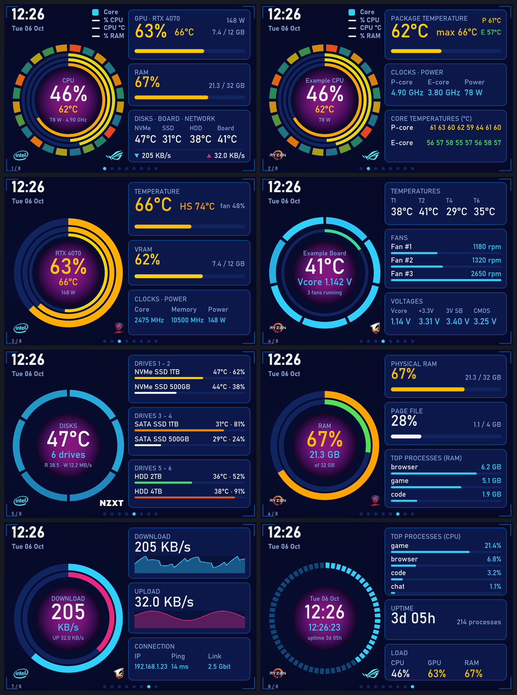
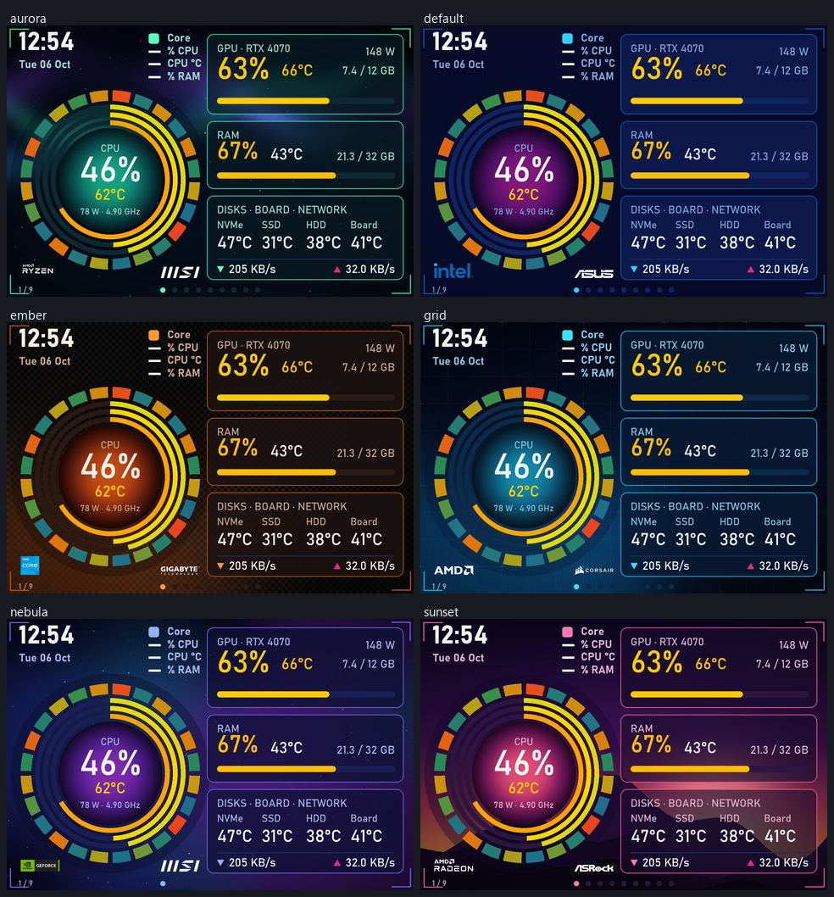
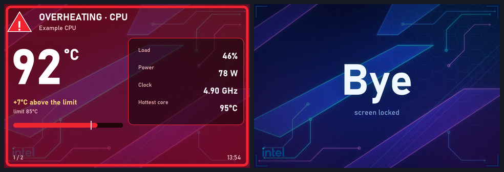

# DisplayMonitor

A standalone, lightweight **system monitor for the TURZX / Turing 3.5" IPS USB display** (320×480, USB‑C, "TURZX 3.5 IPS USB Secondary Display"),
for **Windows 10/11**. It replaces the vendor's `UsbMonitor.exe` with a small Python program that

* shows a **recap page** (CPU, GPU, RAM, disks, board, network) and **7 more pages** you pick from the tray icon,
* reads CPU / GPU / motherboard / disk sensors through [LibreHardwareMonitor](https://github.com/LibreHardwareMonitor/LibreHardwareMonitor),
* talks to the display directly over its USB serial port — **no vendor software, no driver to install on Windows 10/11**,
* only sends the pixels that changed (the display accepts ~165 KB/s, a full frame takes ~1.8 s),
* **starts by itself at logon**, reconnects after sleep / cable unplug, and recovers from the "black screen" state the firmware falls into after a hard kill.

> Not affiliated with TURZX, Turing, ASUS, Intel or LibreHardwareMonitor. Use at your own risk.
> Tested on **one** unit: USB `1A86:5722`, serial `USB35INCHIPSV2` (V2 firmware, "Rev A" protocol), Windows 11, Python 3.12.
> Other 3.5" revisions may work but are untested.



*(screenshots are rendered with invented data: `python tools/make_screenshots.py`. Each one shows a different pair of logos from the shipped library, only to illustrate that the two bottom logos can be swapped.)*

## Features

| Page | Ring | Cards |
|---|---|---|
| **Overview** (always shown) | 24 CPU threads · CPU load · CPU temperature · RAM used | GPU, RAM, disks / board temperatures, network speed |
| CPU | same ring | package temperature, clocks & power, per‑core temperatures |
| GPU | load · VRAM · temperature | temperature, VRAM, clocks & power |
| Motherboard | fan duty · hottest probe | temperatures, fans (rpm), voltages |
| Disks | one segment per drive | temperature + space used for up to 6 drives |
| Memory | RAM · page file | RAM, page file, top processes |
| Network | download · upload | live graphs, IP / ping / link speed |
| System | clock | top processes by CPU, uptime, load |

* **One colour language** for every temperature (°C) and utilisation (%): white below 50, green up to 60, then yellow → orange → red up to 100 (thresholds are configurable).
* **Pages are plain YAML** (`config/pages.yaml`): rings, cards, bars, sparklines, legend, thresholds — no code needed.
* **Temperature alarm**: when the CPU / GPU / RAM / a disk / the motherboard goes above a limit (default 85 °C, per component if you like) the **whole screen turns into an alarm** with the part's name, temperature and details (load, power, fan …), and the backlight goes to full.
* **Night schedule**: dim the screen, or switch it off, between two times.
* **"Ciao" screen**: when the PC locks, sleeps, shuts down or you sign out the display shows a big word on your theme's background instead of a frozen page.
* **Local web preview** with page buttons (tray tick, off by default, local only unless you set a token).
* **Update check** against this repository (`--check-update` / `--update`; one GET, nothing sent, can be disabled).
* **Windows, Linux and macOS** — same pages and features; see [docs/PLATFORMS.md](docs/PLATFORMS.md) for what each platform can read.
* **Hot reload**: save `config.yaml`, `pages.yaml` or a theme and the display updates by itself, no restart (a broken file is reported in the log and the previous configuration is kept).
* **Optional weather page** (Open-Meteo: free, no account), cached and retried with backoff so it survives a slow network at boot.
* **Tray icon**: pick a page (it stays until you go back to the recap), **swap the two logos**, toggle auto‑rotation, brightness, quit.
* **Make it yours** — colours, background pictures, logos, fonts, translucent cards and a compact layout (big clock, bigger ring) are all settings; ten ready-made themes are included (four of them neon) and you can save your own as a one-file preset: **[docs/THEMING.md](docs/THEMING.md)**.
* English and Italian UI.

## Themes



`theme: {preset: nebula}` in `config/config.yaml` switches the look (`default`, `nebula`, `grid`, `ember`, `sunset`, `aurora`, `neon`, `neon-ember`, `neon-toxic`, `neon-sakura`). Your own logos, colours, background picture
and fonts: see **[docs/THEMING.md](docs/THEMING.md)**. Try a theme without a display: `python -m displaymonitor --demo --theme ember --compact`.
**Logos**: the two logos at the bottom of the ring come from a **library of 25 CPU / GPU / motherboard brand logos** (`logos/`: Intel, AMD, NVIDIA, ASUS, MSI, GIGABYTE, ASRock, EVGA, ZOTAC … all public domain on Wikimedia Commons, see [`logos/LOGOS.md`](logos/LOGOS.md)) plus your own (`assets/logos/`). Pick them from the tray menu (*Left logo* / *Right logo*), per page in `pages.yaml`, or import more with `tools/import_logo.py` ([guide](docs/THEMING.md#logos)). The logos are still trademarks of their owners: they are there to identify the hardware you own. The included backgrounds are generated by `tools/make_backgrounds.py`.



## Requirements

*(Linux and macOS: see [docs/PLATFORMS.md](docs/PLATFORMS.md).)*

* Windows 10 / 11 (x64), **administrator rights** (needed to read CPU & motherboard sensors),
* Python 3.12 (3.10–3.13 should work; `pythonnet` is pinned to 3.0.5, see [docs/DEVELOPMENT.md](docs/DEVELOPMENT.md)),
* the display connected by USB‑C (it shows up as a "USB Serial Device (COMx)"; Windows 10/11 has the driver built in),
* the **PawnIO** driver for CPU temperature / clocks / power and motherboard sensors (GPU, disks, RAM and network work without it).
  `scripts\setup.ps1` offers to install it with `winget`. It is a signed kernel driver used by LibreHardwareMonitor ≥ 0.9.5.

## Install

**No Python, no git?** One line in PowerShell downloads the program, installs Python 3.12 for your user if it is missing, and runs the setup
(on Linux / macOS: `curl -fsSL https://raw.githubusercontent.com/DanaVivaldi/turzx-displaymonitor/main/scripts/get.sh | bash`):

```powershell
irm https://raw.githubusercontent.com/DanaVivaldi/turzx-displaymonitor/main/scripts/get.ps1 | iex
```

(options: `-Dir`, `-Language en|it`, `-Autostart`, `-Ref`; read the script first if you like: [scripts/get.ps1](scripts/get.ps1). The Python installer it may download is SHA-256 checked.)

Or by hand:

```powershell
git clone https://github.com/DanaVivaldi/turzx-displaymonitor.git
cd turzx-displaymonitor
powershell -ExecutionPolicy Bypass -File scripts\setup.ps1     # venv + dependencies + LibreHardwareMonitor (hash-checked) + PawnIO (asks)
```

`setup.ps1` asks which **language pack** to install — **English** or **Italiano** (`-Language en|it` skips the question). A pack is a
matching `config.yaml` + `pages.yaml` (page titles, labels, tray menu, weather page text). Switch later with
`python -m displaymonitor --init it --force` (your old files are kept as `*.bak`).

Run it once by hand (elevated PowerShell) to see that everything works:

```powershell
.\.venv\Scripts\python.exe -m displaymonitor
```

Start at every logon (scheduled task, highest privileges, hidden):

```powershell
.\scripts\install_autostart.ps1        # remove with scripts\uninstall_autostart.ps1
```

If the display is mounted the other way up, set `display.rotate: 3` in `config/config.yaml`.

## Usage

* **Tray icon** → *Show page* / *Back to recap* / *Automatic rotation* / *Brightness* / *Quit*.
* **Command line** (talks to the running instance):

  ```powershell
  .\.venv\Scripts\python.exe -m displaymonitor --send quit          # clean exit (always prefer this to killing the process)
  .\.venv\Scripts\python.exe -m displaymonitor --send page:gpu      # show a page;  home | next | prev | rotate | brightness:60
  ```
* `python -m displaymonitor --preview` renders every page with your real sensors to `docs/preview/*.png` (no display needed),
  `--dump-sensors` prints every sensor key, `--demo` renders invented data, `--debug` logs per‑frame statistics.
* Logs: `logs/displaymonitor.log` (and `logs/fault.txt` for native crashes).

## Configuration

Copy/edit `config/config.yaml` (general settings, thresholds, alerts) and `config/pages.yaml` (pages). Both are created from the
language-pack examples (`*.example.yaml` English, `*.it.example.yaml` Italiano) by `setup.ps1`, are git‑ignored and fully documented in **[docs/CONFIGURATION.md](docs/CONFIGURATION.md)**.

## Troubleshooting

| Symptom | Fix |
|---|---|
| CPU temperature / motherboard values are `--` | run elevated and install PawnIO (`winget install namazso.PawnIO`) |
| Screen **black** after the program was killed / crashed | restart the program: it detects the unclean exit (`logs/running.flag`) and flushes the half‑sent bitmap (~13 s). Unplugging the cable also works |
| Image upside down | `display.rotate: 3` (software rotation) |
| Nothing happens, "display not found" in the log | check Device Manager for `USB Serial Device (COMx)` with VID 1A86 PID 5722; close the vendor's `UsbMonitor.exe`, only one program can own the port |
| Wrong network adapter | set `network.interface` in `config.yaml` |
| Two or three `pythonw.exe` processes | normal: the venv launcher, the real interpreter and (Windows) the hardware-sensor child process |
| The display froze on an old screen | the program crashed (a GPU-driver reset can do that): see `logs/fault.txt` / `logs/hw_fault.txt`. Run `scripts\install_autostart.ps1` elevated to get the watchdog that restarts it by itself, see [Crash resilience](docs/CONFIGURATION.md#crash-resilience-windows) |
| Task "Running" but nothing on screen after a quit | the Task Scheduler ignores a start while the previous instance is still exiting: wait a few seconds and start again |

More background on why these things happen: [docs/PROTOCOL.md](docs/PROTOCOL.md).

## How it works (short)

Three layers: **sensors** (a thread polling LibreHardwareMonitor / psutil at different rates) → **renderer** (Pillow, pages described in YAML,
drawn at 3× and downsampled) → **display driver** (diffs the frame in 2 px tiles and sends only changed rectangles, split in blocks of ≤ 12 800 px).
Details in [docs/DEVELOPMENT.md](docs/DEVELOPMENT.md); the reverse‑engineered device behaviour is in [docs/PROTOCOL.md](docs/PROTOCOL.md).

## Credits & licences

Code: MIT, see [LICENSE](LICENSE). The device protocol was documented by the community; this project re‑implements it from scratch and was
informed by [turing-smart-screen-python](https://github.com/mathoudebine/turing-smart-screen-python) (GPL‑3.0),
[Tedd.TuringScreen](https://github.com/tedd/Tedd.TuringScreen) (MIT), [TelemetryForge](https://github.com/riccione83/TelemetryForge) (MIT) and
[TURZX-3.5-Custom-Monitor](https://github.com/xlwreally/TURZX-3.5-Custom-Monitor) (MIT). Sensor access uses
[LibreHardwareMonitor](https://github.com/LibreHardwareMonitor/LibreHardwareMonitor) (MPL‑2.0, downloaded, not redistributed) and the
[PawnIO](https://github.com/namazso/PawnIO) driver. See [THIRD_PARTY_NOTICES.md](THIRD_PARTY_NOTICES.md).

Ideas and what is planned: [docs/ROADMAP.md](docs/ROADMAP.md) · Tests: `python -m pytest` (27 tests, no hardware needed; run on every push by GitHub Actions)

Italiano: [README.it.md](README.it.md)
